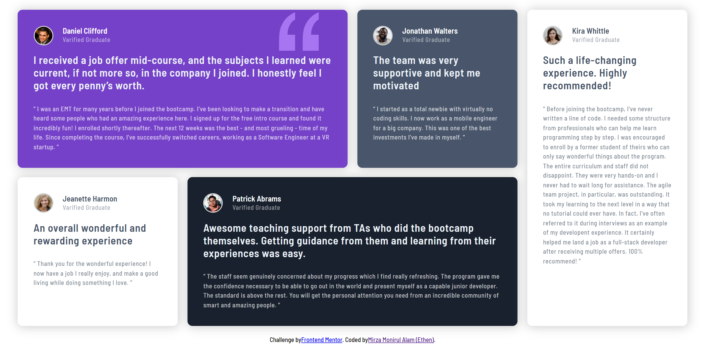
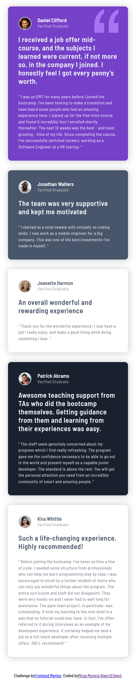

# Frontend Mentor - Testimonials grid section solution

This is a solution to the [Testimonials grid section challenge on Frontend Mentor](https://www.frontendmentor.io/challenges/testimonials-grid-section-Nnw6J7Un7). This challenge focus on grid layout management. Frontend Mentor challenges help you improve your coding skills by building realistic projects. 

- 27 April 2022.

## Table of contents

- [Screenshot](#screenshot)
- [Links](#links)
- [Built with](#built-with)
- [Author](#author)
- [Date](#date)

## Screenshot (Desktop)

## Screenshot (Mobile)

## Links

- Solution URL: [Solution](https://your-solution-url.com)
- Live Site URL: [Live](https://ethenpage.github.io/grid-practice/)

## Built with

- Semantic HTML5 markup
- CSS custom properties
- CSS Grid
- Mobile-first workflow
- [React](https://reactjs.org/) - JS library

## Author

- Name - Mirza Monirul Alam
- Frontend Mentor - [@EthenPage](https://www.frontendmentor.io/profile/ethenpage)
- FreeCodeCamp - [@EthenPage](https://www.freecodecamp.org/EthenPage)

## Date

- 27 April 2022.